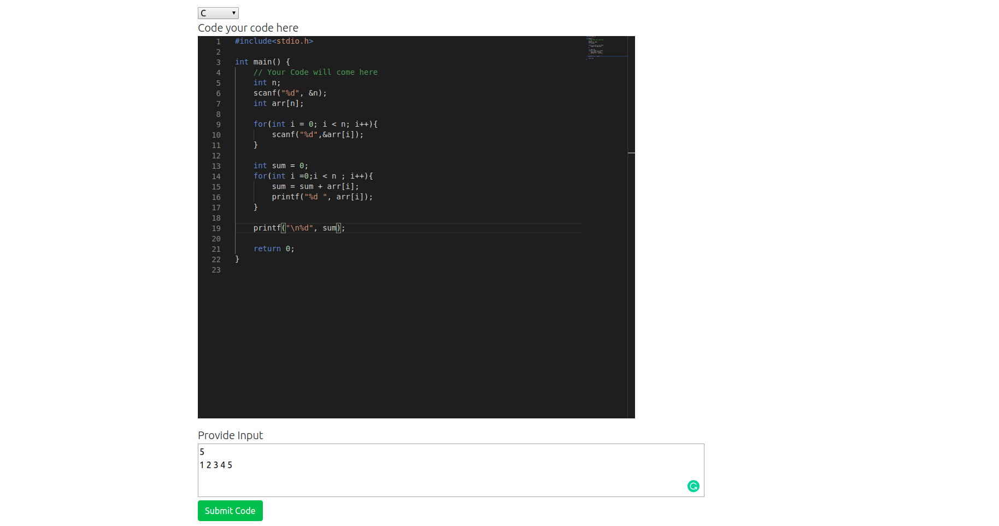
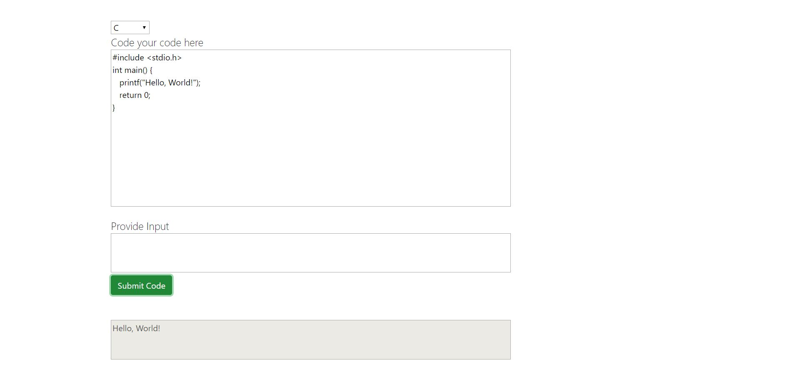
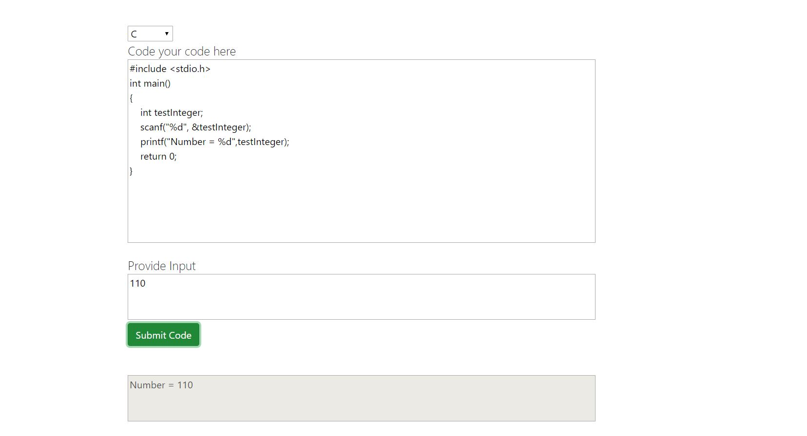
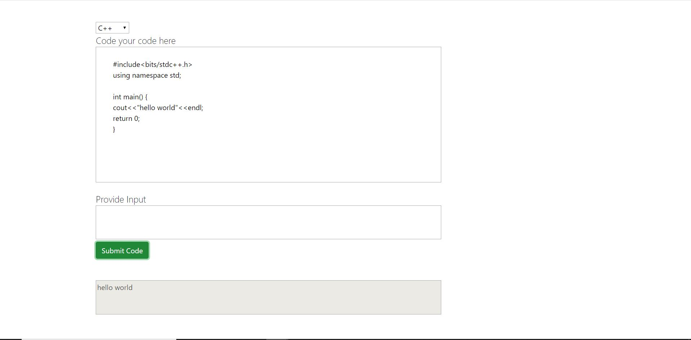
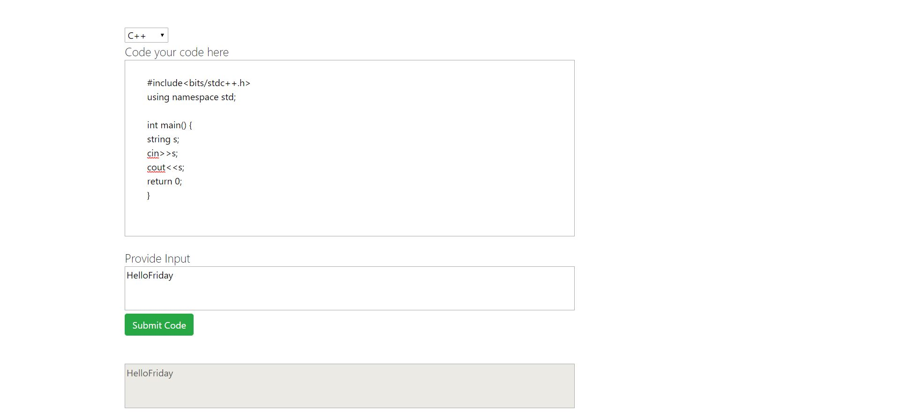
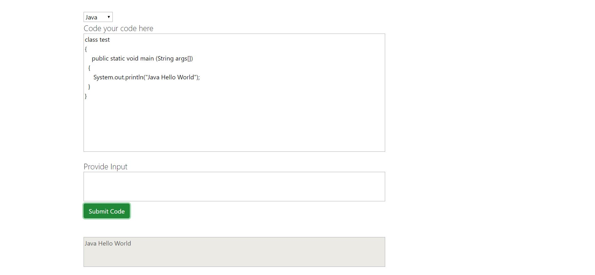
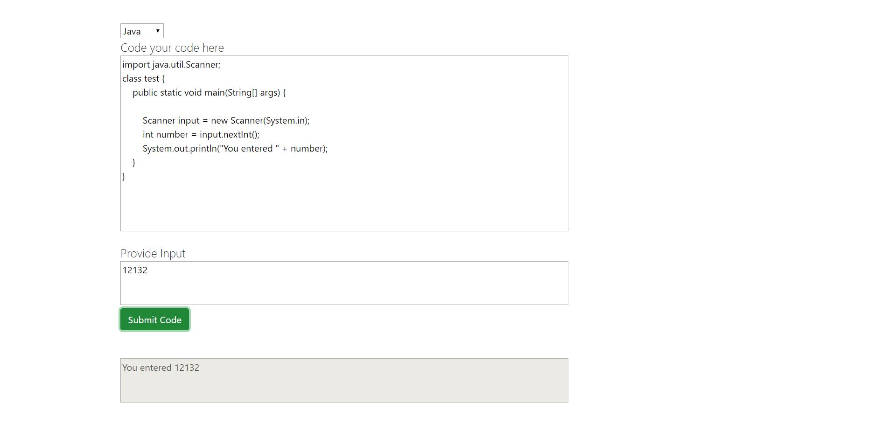
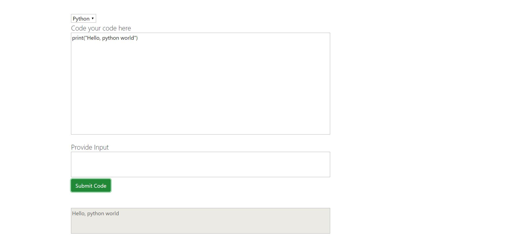
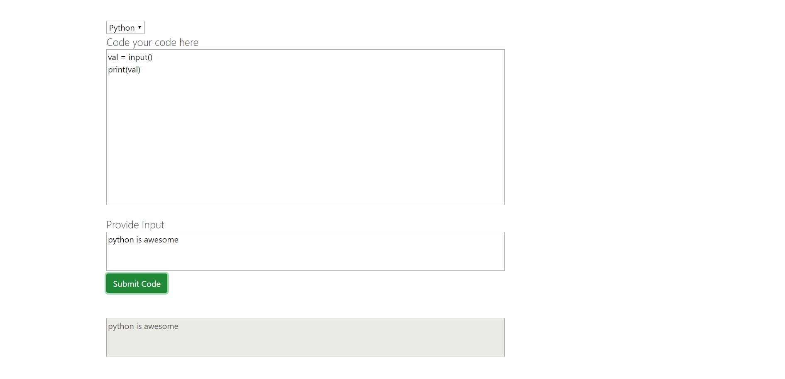

# Sudo-Ide
An interactive IDE for writing code ```Windows only```.

## Use it
1. Clone the project on your system
2. Move into ```ide-server``` and run ```npm install``` then ```npm run dev``` to start the server
3. Move into ```ide-client``` and run ```npm install``` then ```npm start``` to start the react server

Note:-<br>
Remember to set the path of ```C```, ```C++```, ```Java```, ```python``` in your system <br>
by setting environment variables.


### IMPROVED FEATURES
Added VS Code Editor to the app !!!!
New Look


### Available Language
1. ### C
#### Without Input

#### With Input


2. ### C++
#### Without Input

#### With Input


3. ### Java
#### Without Input

#### With Input


4. ### Python
#### Without Input

#### With Input



